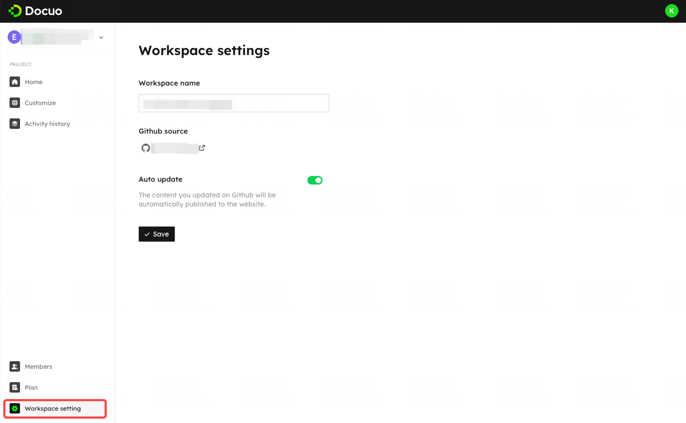

# Workspace settings

Click on the Workspace settings tab to enter the workspace setting page. You can change your workspace name, view your GitHub repository source, and manage the auto update function.

<Frame width="auto" height="auto" >
  
</Frame>

| Setting        | Description                                                  |
| :------------- | :----------------------------------------------------------- |
| Workspace name | Your workspace's name                                        |
| GitHub source  | The GitHub account your workspace is linked to. Hit the GitHub source access icon, you can open your GitHub configuration page. |
| Auto-update    | Set whether to turn on the automatic update function. See [Auto update](../Updating%20website/Make%20an%20update.mdx#auto-update). |