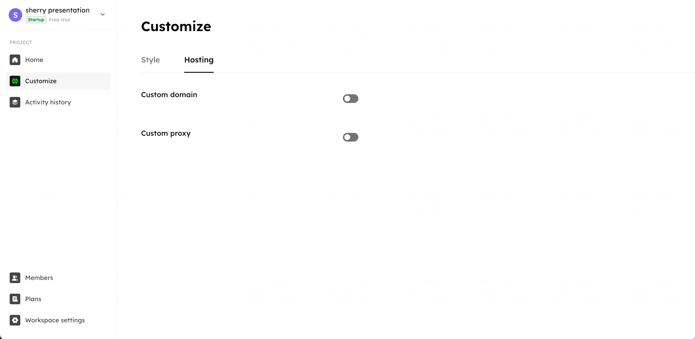
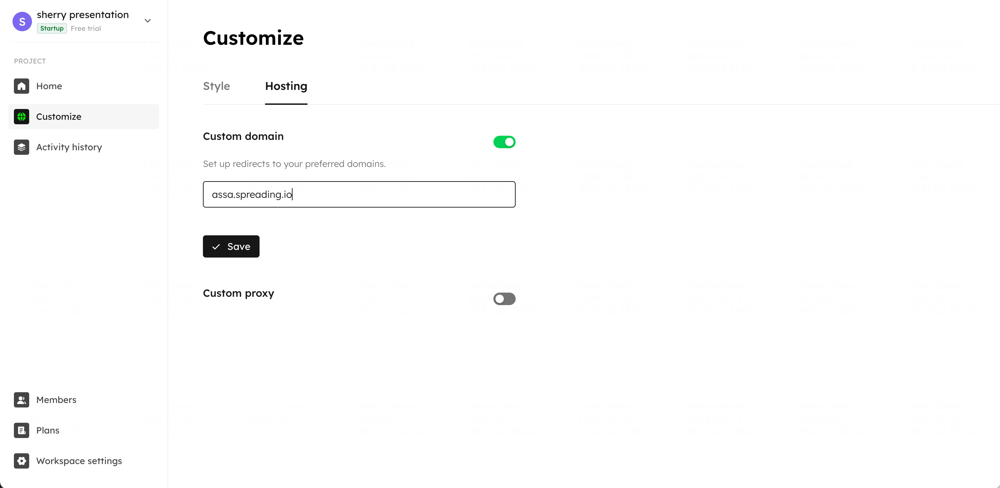
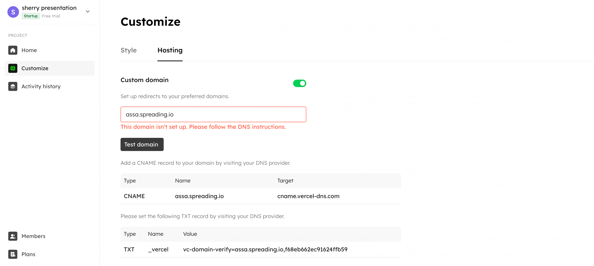
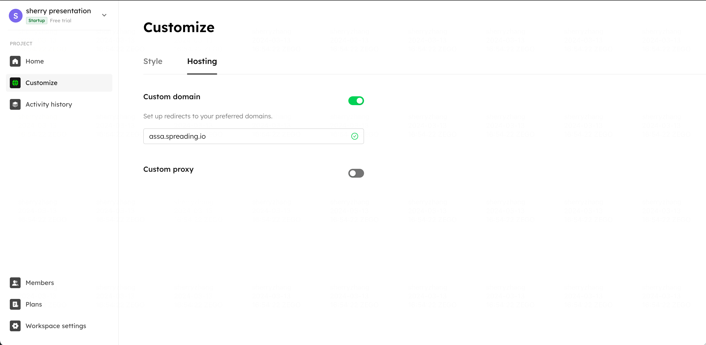
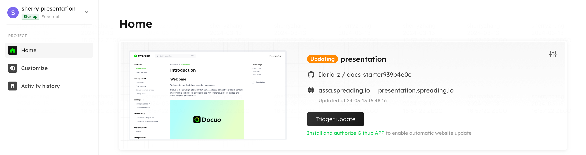

# Custom Domain

Docuo supports hosting the documentation at your website's custom domain.

## Set up custom domain
1. Go to customize page:
head over to your project **Customize** page, and click on **Hosting** to enter the subtab page.

<Frame width="auto" height="auto" >
  
</Frame>

2. Fill in you domain:
Turn on the custom domain setting switch, and fill in your custom domain(e.g., `project.yourdomain.com`). The system will check the uniqueness of your custom domain.

<Frame width="auto" height="auto" >
  
</Frame>

3. Verify vercel:
If Vercel happens to be your domain provider, you will have to add a verification `TXT` record. This information will show on your dashboard after submitting your custom domain.


4. Configure DNS:
After submitting the custom domain and completing vercel verification, you need to create a new DNS entry with the following values:

```
CNAME | custom_domain | cname.vercel-dns.com
```

<Frame width="auto" height="auto" >
  
</Frame>

5. Test setup:
Click on "Test domain". If your DNS has been successfully configured, congratulations, your domain setup is complete!

<Frame width="auto" height="auto" >
  
</Frame>


After setting up your custom domain, it will shown on the homepage.

<Frame width="auto" height="auto" >
  
</Frame>


## Set up custom proxy
1. Turn on the custom proxy setting switch.
2. Fill in your proxy path(e.g., `/docs`). Then click **Save**.

<Frame width="auto" height="auto" >
  
</Frame>

When triggering “Save”, we will add the proxy path prefix to the path on your domain. The next time you visit your site,  just use `custom_domain+path`(e.g., `project.yourdomain.com/docs`).


If you have any questions on setting up custom domain, please [**Contact us**](https://tally.so/r/wzy5Qq/). 


## Reverse proxy

If you want to host your documentation on a second-level domain (e.g., www.yourdomain.com), you can configure reverse proxy on your server.

Here's a Nginx reverse proxy configuration example:

Suppose I have published my documentation successfully and got a available subdomain: **test.spreading.io**, and I want to host my documentation to https://www.yourdomain.com/docs/.

First, you need to set up `custom proxy` to `/docs` on the Customize page.

Then, reverse proxy configuration in Nginx should be like:

```
server {
  location ^~  /docs/ {
    proxy_pass https://test.spreading.io;
  }
}
```

Then restart Nginx and visit https://www.yourdomain.com/docs, Nginx will redirect to the target address: https://test.spreading.io/docs.