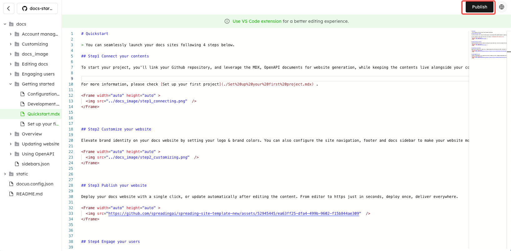

# Markdown editor

You can directly edit your documents using the markdown editor on the platform.

<Note title="Note">
The Markdown Editor uses a short-hand syntax style text to create documents and then converts the text to HTML. It is handy when more text files are involved.
</Note>

Log in to Docuo platform, and click "Editor" to enter the markdown editor page. You will see your docs repository directory on the left side of the page.

You can edit your existing md/mdx or json files on the platform. Then click "**Publish**" button in the upper right corner of the page to update your edited content to the website.

<Frame width="auto" height="auto" >
  
</Frame>

<Tip title="Tip">
Recommend you to use [**VS Code extension**](https://marketplace.visualstudio.com/items?itemName=spreading-docuo.docuo) for a better editing experience.
</Tip>

## Doc front matter

The front matter is used to provide additional metadata for your doc page. Front matter is optional—Docuo will be able to infer all necessary metadata without the front matter.

Markdown documents can use the following Markdown front matter metadata fields, enclosed by a line --- on either side.

Accepted fields:

| Name                | Description                                                                                        | Default                                         |
| :------------------ | :------------------------------------------------------------------------------------------------- | :---------------------------------------------- |
| title               | Document title.                                                                                    | File name.                                      |
| description	        | Metadata description at the page level.                                                            | Text content in the first line of the document. |
| og:site_name	      | When sharing a link, the name of the website from which the link originated is displayed.          | Same as the title in docuo.config.json.         |
| og:title	          | The title that appears when sharing.                                                               | Same as the title field above.                  |
| og:description      |	The description that appears when sharing. Provide a short description of the content of the page. | Same as the description field above.            |
| og:url              |	The URL of the page. Make sure it matches the URL of the actual page.                              | -                                               |
| og:image            |	The URL of the image displayed when sharing. Attractive images are often used.                     | -                                               |
| og:locale	          | Language and region of the page. Use ISO 639-1 and ISO 3166-1 alpha-2.                             | -                                               |
| og:logo             |	The URL of the website logo image. Focus on the logo of the site.                                  | Same as the logo in docuo.config.json.          |
| article:publisher   |	For article pages, specify the Facebook page URL of the article's publisher (publisher).           | -                                               |
| twitter:title       |	The title displayed in the Twitter Card.                                                           | Same as the title field above.                  |
| twitter:description |	Description shown in the Twitter Card.                                                             | Same as the description field above.            |
| twitter:url         |	URL of the link in the Twitter Card.                                                               | -                                               |
| twitter:image       |	The URL of the image displayed in the Twitter Card.	                                               | The first image to appear in the article.       |
| twitter:site        |	The website's (or author's) Twitter account in the Twitter Card.                                   | -                                               |
| og:image:width      |	Width of the 'og:image' in image. Helps improve page loading performance.                          | -                                               |
| og:image:height     |	Height of the 'og:image' in image. Helps improve page loading performance.                         | -                                               |

Please refer to [The Open Graph protocol](https://ogp.me/) for details.
