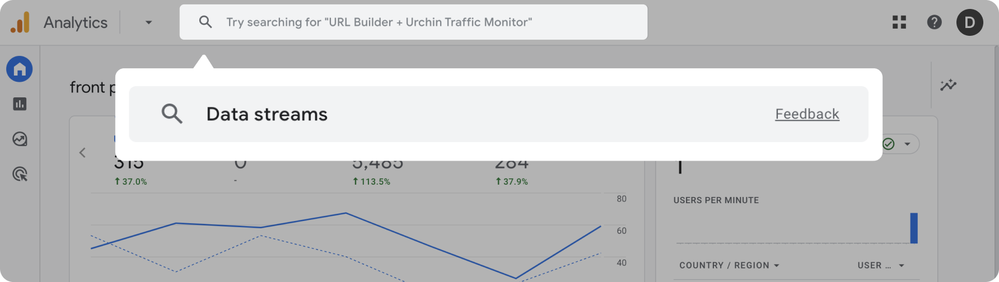
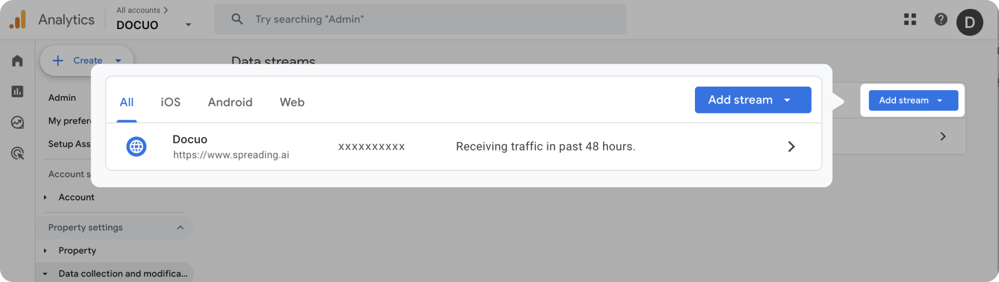
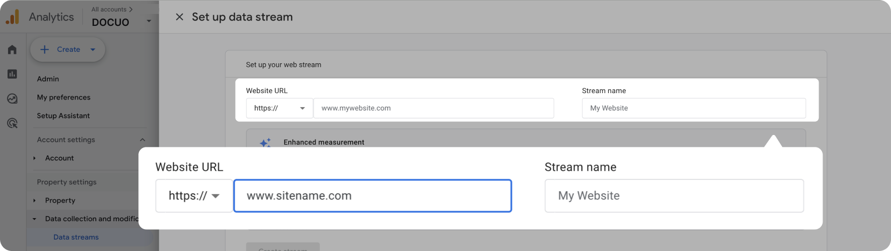
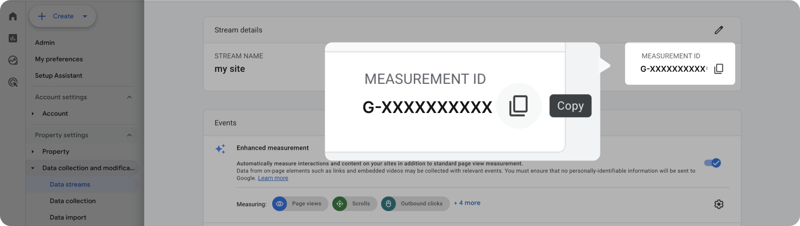

# Analytics

Docuo supports third-party data ananlytics intergration, [Google Analytics 4](https://support.google.com/analytics/answer/10089681), to help you receive Docuo insights about your visitors and customer usage of your published documentation.

## About Google Analytics 4

Google Analytics 4(GA4) is a web analytics service that provides statistics and basic analytical tools to help you measure traffic and engagement across your published websites. It allows you to get an in-depth understanding of how your website visitor interacts across your websites and apps throughout their lifecycle, which can help you make smarter decisions.

See [more information](https://developers.google.com/analytics/devguides/collection/ga4) about GA4.

## Set up GA4 on the platform

#### 1. Go to GA4 data stream page

When you sign up for GA4, you'll enter the dashboard homepage. You can find the data stream page via search box.

<Frame width="auto" height="auto" >
  
</Frame>

#### 2. Get measurement ID

Click"Add stream", fill in your website URL and stream name to get your site stream. After successfully creating a data stream, you'll be given a measurement ID(like UA-11111111 or G-1111111ABC).

<Frame width="auto" height="auto" >
  
</Frame>

<Frame width="auto" height="auto" >
  
</Frame>

<Frame width="auto" height="auto" >
  
</Frame>

#### 3. Fill in the measurement ID

Go back to Docuo Analytics page, and fill in the measurement ID you just got from GA4. Click "Save", and your docs website will be successfully linked to your GA4 platform. You can configure your own data dashboard on the platform based on your needs.

<Frame width="auto" height="auto" >
  
</Frame>

<Tip title="Attention">
GA4 will take 24-48h to show your data.
You can use the Google [Analytics Debugger](https://chromewebstore.google.com/detail/google-analytics-debugger/jnkmfdileelhofjcijamephohjechhna?hl=en) to check analytics are enabled correctly. The extension will log to your browser’s console every time GA4 makes a request.
</Tip>

## Set up GA4 with json file

You can also set the measurement ID to your docuo.config.json, feel like so:

```json
"analytics": {
  "ga4": {
    "measurementId": "G-XXXXXXX"
  }
}
```
