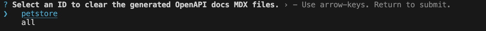

# Development

Preview changes locally to update your docs

<Tip title="Prerequisite">Please install Node.js (version 19 or higher) before proceeding.</Tip>

Follow these steps to install and run Docuo on your operating system:

**Step 1:** Install Docuo
<CodeGroup>
```bash npm
npm i -g @spreading/docuo
```

```bash yarn
yarn global add @spreading/docuo
```
</CodeGroup>

**Step 2:** Navigate to the docs directory (where the docuo.config.json file is located) and execute the following command:
```bash
docuo dev
```

## Custom Ports

By default, Docuo uses port 3000. You can customize the port Docuo runs on by using the `--port` flag. To run Docuo on port 3333, for instance, use this command:
```bash
docuo dev --port 3333
```

## Clear local build cache

When you run `docuo dev` for the first time, the build template will be cloned and cached locally.
As a result, next time you run `docuo dev` will be faster, but the build template is probably out of date.
So if your local website doesn't align with the production version, please run this command before you run `docuo dev`.
```bash
docuo clear
```

## Managing docs versions

Run `docuo version` to creating or deleting a specified version in the corresponding document instance. [Read more](../Editing%20docs/Managing%20docs/Docs%20versioning.mdx) .
```bash example
docuo version --create 0.1.0
```

### Options

| Name         | Description                                                  |
| ------------ | ------------------------------------------------------------ |
| `--create`   | Create a new version.                                        |
| `--delete`   | Delete specified version, enter the confirmation button as prompted. |
| `--instance` | Specifies the document instance of the version to operate on, or uses the default document instance if not specified. |

## Managing docs instances

Run `docuo instance` to creating or deleting the specified document instance. [Read more](../Editing%20docs/Managing%20docs/Docs%20Multi-instance.mdx) .
```bash example
docuo instance --create android
```

### Options

| Name       | Description                                                  |
| ---------- | ------------------------------------------------------------ |
| `--create` | A combination of lowercase letters, digits, and underscores is supported.<br />Create a new document instance, you need to be prompted for the values of each option.<br />`label`: The default is instance id<br />`routeBasePath`: The default is instance id<br /> |
| `--delete` | Delete specified document instance, enter the confirmation button as prompted. |

## OpenAPI

Read more on [OpenAPI configuration](../Using%20OpenAPI/Setup%20OpenAPI.mdx) .

### Generate

Run `docuo gen-openapi-docs` to generate the corresponding mdx documentation according to the specified `OpenAPI` documentation.

This command needs to be used in conjunction with the `openapi` parameter in `docuo.config.json`.

The command will list all the configs of `openapi` option, identified by the `id`. Select the corresponding `id`. Then docuo document will be generated internally according to the corresponding `id` configuration.


<Note>
`all` is the internal default, indicating that all documents are generated based on all configurations.
</Note>

Here is an example: 
 
```json docuo.config.json
{
  "openapi": {
    "petstore": {
      "specPath": "docs/Using OpenAPI/OpenAPI Demo/petstore.yaml",
      "outputDir": "docs/Using OpenAPI/OpenAPI Demo"
    }
  }
}
```

### Clear

Run `docuo clean-openapi-docs` to clears the specified `OpenAPI` mdx documentation.

This command needs to be used in conjunction with the `openapi` parameter in `docuo.config.json`.

The command will list all the configs of `openapi` option, identified by the `id`. Select the specified `id` to clear.



<Note>
`all` is the internal default, indicating clear all.
</Note>


## Deployment

### Automatically

Install our GitHub App and turn on the "Auto update" switch on the [Setting page](https://app.spreading.ai/workspace/setting/). Changes will be deployed to production automatically after pushing to the default branch.

### Manually

Click the "Tigger update" button on the [Home page](https://app.spreading.ai/home) to update your project.