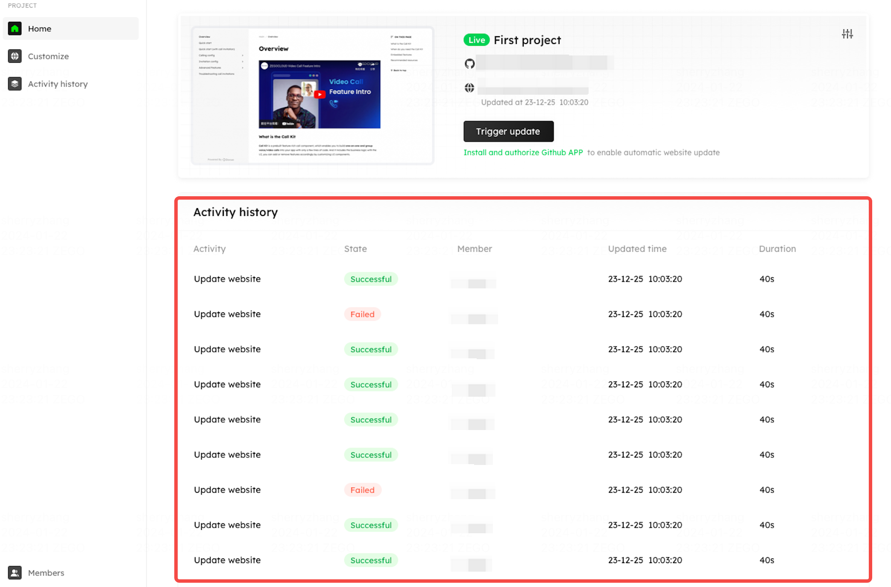
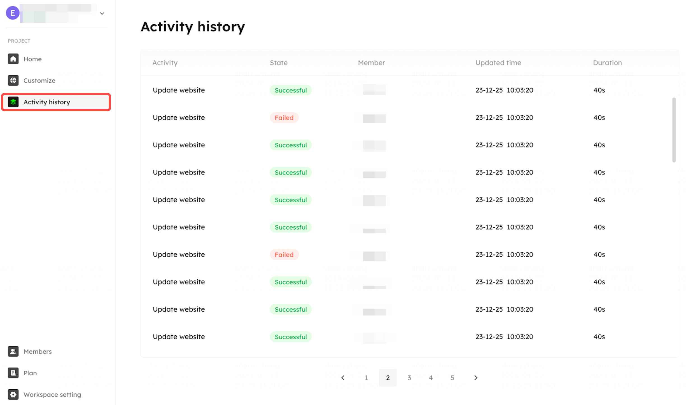

# Activity history

Each site update operation will generate an activity history message. The activity history will record and display the status of each update (whether the update was successful), completion time, updating duration, and updating member.

You can see the latest on the homepage. 

<Frame width="auto" height="auto" >
  
</Frame>

Or you can also find the whole activity history of the project website in the Activity history tab.

<Frame width="auto" height="auto" >
  
</Frame>
