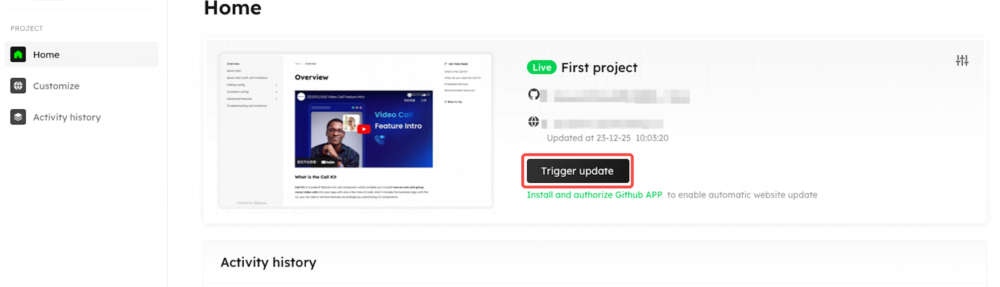
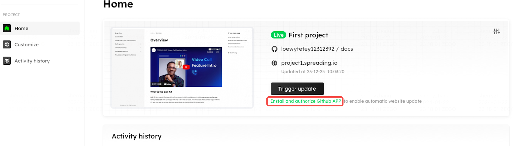

# Make an update

Docuo supports both manual and auto update.

## Manual update
As you finish editing the contents of your docs repository on GitHub, you can go to the project homepage and hit the "Trigger updating" to update your latest editing to the website.

<Frame width="auto" height="auto" >
  
</Frame>

## Auto update

If you want to update your website automatically, you can install and authorize our GitHub app.

Click text "Install and aythorize GitHub APP" below the manual update button on the homepage, and the  GitHub app authentication window will open. Follow the window guide to finish the authentication process. 

Once the GitHub app is successfully installed, the docs content and site settings you renew in the GitHub repository file will be automatically updated on the website.

<Frame width="auto" height="auto" >
  
</Frame>

You can choose to turn off or turn on the automatic update function in the Workspace settings page.

<Frame width="auto" height="auto" >
  
</Frame>
