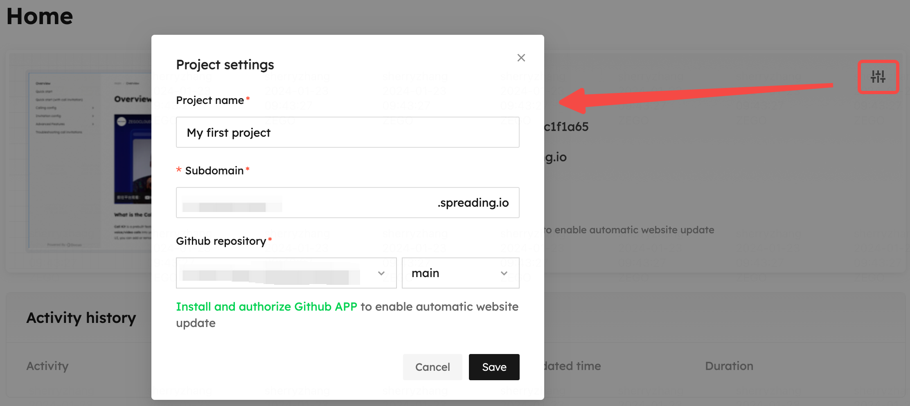

# Project settings

Hit the project setting icon, a pop-up window will appear. You can reset your project name, subdomain, and change github repository.

Once you hit **Save** button, your website will be updated.

<Frame width="auto" height="auto" >
  
</Frame>

Once you hit **Save** button, your website will be updated.
