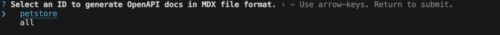
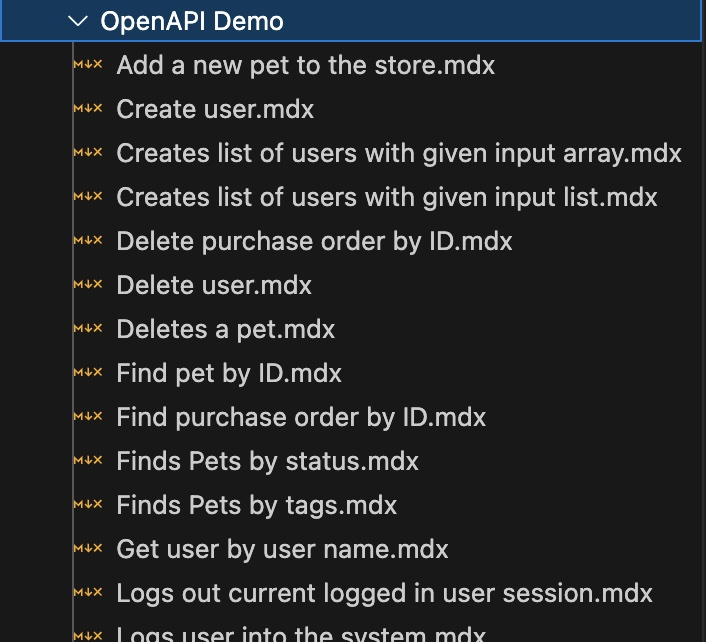

# OpenAPI Setup

Reference OpenAPI endpoints in your docs pages

## Add an OpenAPI specification file

To describe your endpoints with OpenAPI, make sure you have a valid OpenAPI document in either JSON or YAML format that follows the [OpenAPI specification](https://swagger.io/specification/). Your document must follow OpenAPI specification 3.0+.
Then add your OpenAPI documents directly to your docs repo.


1. Define an `id` to uniquely identify the OpenAPI document. e.g. `petstore`. The value must be a string of lowercase letters and digits
2. Then set the path of the OpenAPI document to the `specPath` field of the openapi config in your `docuo.config.json`:

<CodeGroup>

```json docuo.config.json {3,4}
{
  "openapi": {
    "petstore": {
      "specPath": "docs/Using OpenAPI/OpenAPI Demo/petstore.yaml",
      "outputDir": "docs/Using OpenAPI/OpenAPI Demo"
    }
  }
}
```

</CodeGroup>

## Create MDX files for OpenAPI endpoints

To add the OpenAPI endpoints into your docs, each endpoint requires a corresponding MDX file. You can autogenerate these MDX files from your OpenAPI documents with Docuo [CLI](../Getting%20started/Development.mdx).

According to the following two parts:

1. Specify the directory where MDX files corresponding to OpenAPI endpoints should be generated with `outputDir`.

<Tip>
It must correspond to the `id` of the OpenAPI document above.
</Tip>

```json docuo.config.json {5}
{
  "openapi": {
    "petstore": {
      "specPath": "docs/Using OpenAPI/OpenAPI Demo/petstore.yaml",
      "outputDir": "docs/Using OpenAPI/OpenAPI Demo"
    }
  }
}
```

2. Then run the generate command

<CodeGroup>
```bash Normal
docuo gen-openapi-docs
```

```bash Shothand
docuo god
```
</CodeGroup>



After the generation process is completed, you will probably see a similar files output:
<Frame width="300" height="auto" caption="">
  
</Frame>

The generated mdx document is exactly like other documents. It can be configured in the sidebars file or automatically generated and added to the routing system. You can refer to the [sidebars](../Editing%20docs/Managing%20docs/Sidebar.mdx) module.
